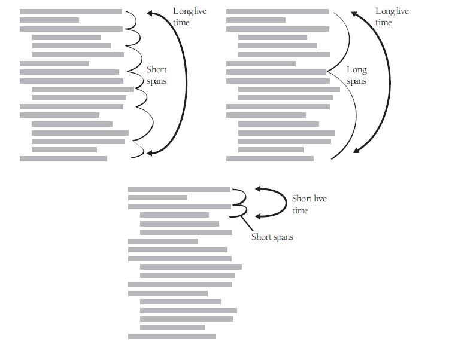

### 10.1 Data literacy

### 10.2 Makeing var declarations easy

Implicit Declarations

### 10.3. Guidelines for initializing vars
`KP:` improper data initialization
+ The var has never been assigned a value.
+ The value in the var is outdated.
+ Part of the var has been assigned and part has not.

Guidelines for avoiding initialization problems:
1. Init each var as it's declared.
2. Init each var close to where it's first used. [page 241] 
3. Ideally, declare and define each var close to where it's first used.
4. Use final or const when possible
5. Pay special attention to counters and accumulators
6. Initiaize a class's member data in its constructor
7. Check the need for reinitialization - *ask yourself whether the var will ever need to be re-init*
8. Init named constants once; init vars with executable code
9. Use the compiler setting that auto init all vars
10. Take advantage of your compiler's warnining msg
11. Check input parameters for validity
12. Use a memory-access checker to check for bad pointers. [checker from OS layer]
13. Init working memory at the beginning of your program

### 10.4 Scope
1. Localize Ref to vars
2. Keep vars "live" fro as short a time as possible

`KP:`Measuring the LT(live time) of a var
3. General guidelines for minimizing scope
    + Init vars used in a loop immediately before the loop **rather than** back at the beginning of the routine containing the loop.
    + Don't assign a value to a var until just before the value is used
    + Group related statements
    + Break groups of related statements into separate routines
    + Begin with most restricted visibility, and expand the variable's scope **only if necessary**

4. Comments on minimizing scope

### 10.5 Persistence
For life span of a piece of data

### 10.6 Binding time
With far-reaching implications for program maintenance and modifiability - "Binding time"
Summary: 
+ codeing time (use of magic numbers)
+ compile time (use of a named constant)
+ load time
+ obj instantiation time
+ just in time

### 10.7 Relationship between data types and control structures
1. sequential data translates to sequential statements in a program
2. selective data translates to if and case statements in a program
3. Interative data translates looping structures(for/repeat/while)

### 10.8 Using each var for exactly one purpose