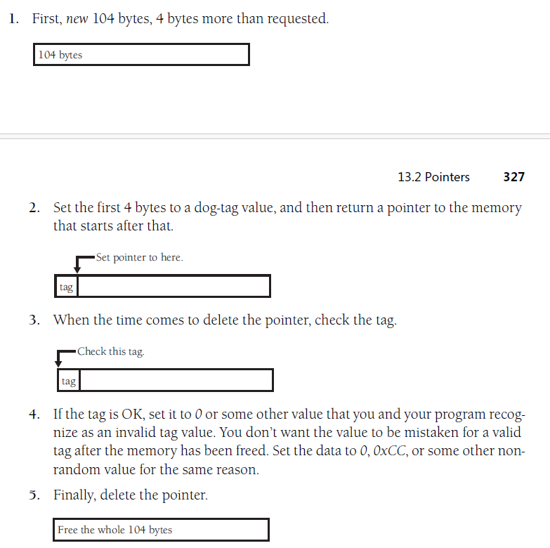
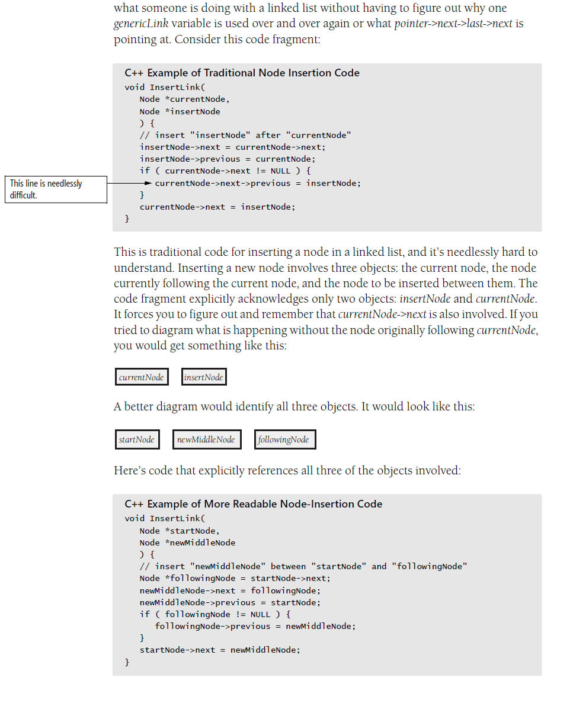

### 13.1 Structures
Some reasons for using structures:
* use structures to clarify data relationships
* ... to simplify operations on blocks of data
* ... to simplify paramter lists
* ... to reduce maintenance

### 13.2 Pointers

Paradigm for understanding pointers
* Conceptually, every pointer consists of two parts: `a location in memory` and `a knowledge of how to interpret the contents of that location`

1. location in memory
`KP:` virtual address
2. knowledge of ...
`KP:` pointer type

General tips on pointers
1. Isolate pointer operations in routines or classes
    + write access routines instead of manual operation
2. Declare and define pointers at the same time
3. Delete pointers at the same scoping level as they were allocated
4. Check pointers before using them
5. Check the var referenced by the pointer before using it
6. Use `dog-tag` fields to check for corrupted memory
    + `dog-tag` is a field you add to a structure soley for the purpose of error checking
    
7. Add explicit redundancies
    + An alternative to using a tag field is to use certain fields twice.
8. Use extra pointer variables for clarity
    
9. Simplify complicated pointer expressions
10. Draw a picture
11. Delete pointers in linked lists in the right order
12. Allocate a reserve parachute of memory
    + what: to avoid the problem of suddenly running out of memory, leaving your user and your user's dat lost in RAM space
    + how: to preallocate a memory parachute at the beginning of the program and leave it alone
13. Shred your garbage
14. Set pointers to null after deleting or freeing them
15. Check for bad pointers before deleting a var
16. Keep track of pointer allocations
17. Write cover routines to centralize your strategy to avoiding pointer problems
    + In C++: `SAFE_NEW` `SAFE_DELETE`
18. Use a nonpointer Tech
    + Pointers are harder than average to understand, they’re error-prone, and they tend to require machine-dependent, unportable code. If you can think of an alternative to using a pointer that works reasonably, save yourself a few headaches and use it instead

C++-Pointer pointers 
1. understand the diff between pointer(*) and references(&)
    + the most significant diff are that a ref MUST always refer to an `object`, whereas a pointer can point to null, and what a ref refers to `can't be changed after the ref is initialized`
2. Use pointers for "pass by reference" parameters and use const references for "pass by value" parameters
    + C++ `defalut` to passing args to routines `by value` rather than by 
3. Use `auto_ptrs`
4. Get smart about smart pointers

C-Pointer pointers
1. Use explicit pointer types rather than the default type
2. Avoid type casting
    + A program that requires many type casts probably has some `architectural gaps` that need to revisited. Redesign if possible; otherwise, try to avoid type casts as much as you can.
3. Follow the asterisk rule for parameter passing
4. Use `sizeof()` to determin the size of a variable in a memory allocation

### 13.3 Global data
KP: Even if global vars don't always produce errors, however, they're hardly ever the best way to program.

1. Common problems with global data
    + Inadvertent changes to global data - you might change the value of a global var in one place and mistakenly think that it has remained unchanged somewhere else - `Side Effect`
    + Bizarre and exciting aliasing problems with global data - **aliasing** refers to calling the same variable by two or more different names.
    + Re-entrant code problems with global data - multithreaded code make global data shared not only among routines, but among different copies of the same program.
    + Code reuse hindered by global data
    + Uncertain initialization-order issues with global data
    + Modularity and intellectual manageability damaged by global data

2. Reasons to use global data - useful in several situations
    + Preservation of global values
    + Emulation of named constants - some language like python/perl/awk don't support named constants
    + Emulation of enumerated types
    + Streamlining use of extremely common data
    + Eliminating tramp data

3. Use global data only as a last resort
    + Begin by making each var local and make var global ony as you need to
    + Distinguish between global and class vars
    + Use access routines

4. Using access routines instead of global data - anything you can do with global data, you can do better with access routines

    Advantages of access routines:
    + you get centralized control over the data
    + you can ensure that all refs to the var are barricaded
    + benefits of information hiding auto
    + access routines are easy to convert to an abstract data types
    
    How to use access routines:
    + require all code to go through the access routines for the data
    + don't just throw all your global data into the same barrel
    + use locking to control access to global vars
    + build a level of abstraction into your access routines - `build access routines at the level of problem domain rather than at the level of the implementation details`
    + keep all accessees to the data at the same level of abstraction

5. How to reduce the risks of using global data
    + develop a naming convention that makes global var obvious
    + create a well-annotated list of all your global vars
    + don't use global var to contain intermediate results
    + don't pretend you're not using global data by putting all your data into a monster obj and passing it everywhere

---
checklist