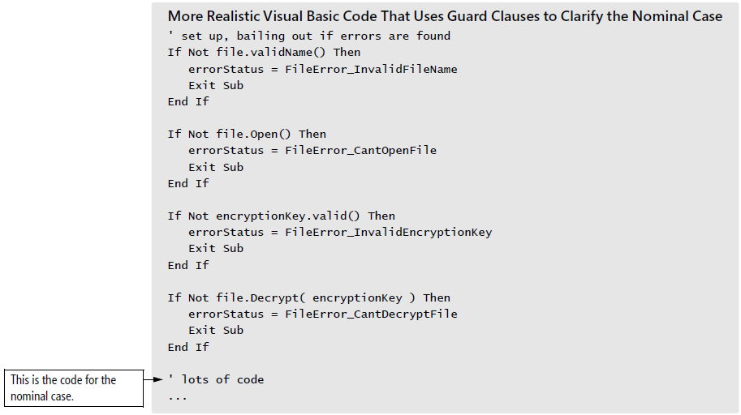
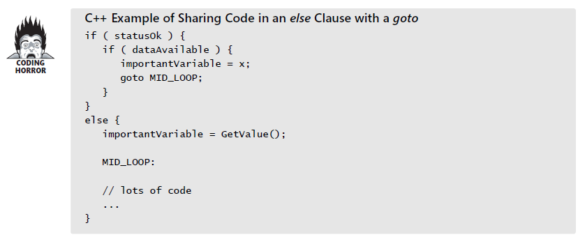

### 17.1 Multiple returns from a routine

1. use a return when it enhances readability - expected result, return immediately; write more code when detects an error
2. use guard clause(early returns or exit) to simplify complex error processing

3. minimize the number of returns in each routine - `use return only when they improve readability`

### 17.2 Recursion
`KP:` recursion isn't useful often, but when used judiciously it produces elegant solutions

1. example of recursion - maze
2. tips for using recursion
    + make sure the recursion stops
    + use safety counters to prevent infinite recursion
    + keep an eye on the stack - with recursion, you have no guarantees about how much stack space your program uses; first: safety counter, and setting a limit for the counter; second, watch for allocation of local vars in recursive functions, especially memory-intensive objs
    + don't use recursion for factorials or fibonacci numbers `KP:` consider alternatives to recursion before using it

### 17.3 goto

1. the argument against gotos - `Dijkstra 1968 ACM`
2. the argument for gotos 
    + a well-placed goto can eliminate the need for duplicate code
    + the goto is useful in a routine that allocates resources, performs operations on those resources, and then deallocates the resources - `good programming doesn't mean eliminating gotos`
3. the phony goto debate
4. error processing and gotos
5. rewrite with nested if statements - less readable and more code
6. rewrite with a `status` var - avoid deeply nested *if-then-else* statement in #5
7. rewrite with try-finally

Comparison of the approaches - keep consistency with each approach

8. gotos and sharing code in an *else* clause

Summary of guidelines for using gotos:
* use gotos to emulate structured control constructs in languages that don't support them directly.
* don't use goto when an equivalent built-in construct is available
* measure the performance of any goto used to improve efficiency.
* limit yourself to one goto label per routine unless you're emulating structured constructs
* limit yourself to gotos that go `forward, not backward` unless you're emulating structured constructs
* make sure all goto labels are used
* make sure a goto doesn't create unreachable code
* If you’re a manager, adopt the perspective that a battle over a single goto isn’t worth the loss of the war. If the programmer is aware of the alternatives and is willing to argue, the goto is probably OK

### 17.4 perspective on unusual control structures
* ■ Unrestricted use of gotos
* ■ Ability to compute a goto target dynamically and jump to the computed location
* ■ Ability to use goto to jump from the middle of one routine into the middle of
another routine
* ■ Ability to call a routine with a line number or label that allowed execution to
begin somewhere in the middle of the routine
* ■ Ability to have the program generate code on the fly and then execute the code
it just wrote

---
checklist