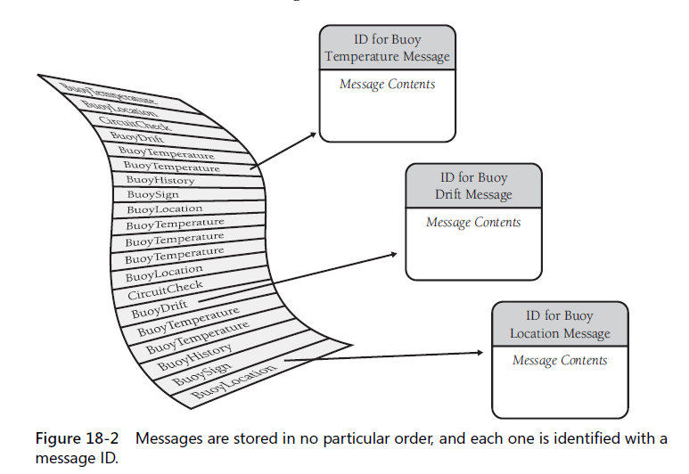
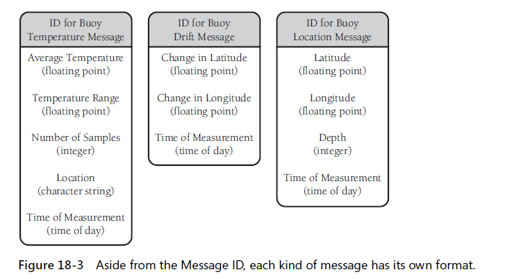

A table-driven method is a `schema` that allows you to look up information in table rather than using logic statement to figure it out
### 18.1 general considerations in using TDM(Table-Driven Methods)
`KP:` used in appropriate circumstances, TD code is simpler than complicated logic, easier to modify, and more efficient.

1. two issues using TDM `KP`
    + how to look up entries in the table ? 
        + Direct access
        + Indexed access
        + stair-step access
    + what you should store in the table ?

### 18.2 direct access tables
1. ...
2. ...
3. Flexible-Message-Format example



    + logic-based approach
    + obj-oriented approach
    + `table-driven approach`
4. fudging lookup keys - several ways:
    + duplicate information to make the key work directly
    + transform the key to make it work directly
    + isoloate the key transformation in its own routine

### 18.3 Indexed access tables
```
Array of indexes -> lookup table
```

### 18.4 Stair-Step access tables
`KP:` it doesn't waste as much data space
Considerations:
1. watch the endpoints
2. consider using a binary search rather than a sequential search (`spell error in page428`)
3. consider using indexed access instead of the stair-step technique
4. put the stair-step table lookup into its own routine

### 18.5 other examples of table lookups