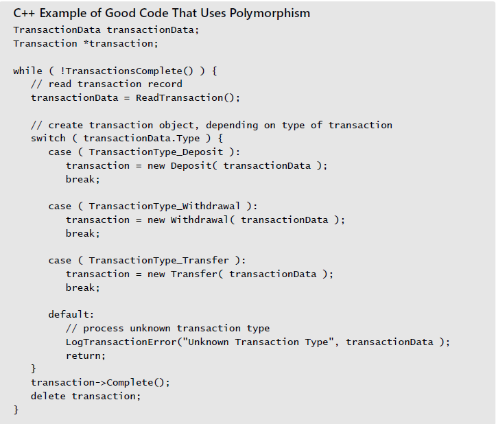

### 19.1 Boolean expressions

1. using *true* and *false* for boolean tests
    + Compare boolean values to true and false implicityly

2. making complicated expressions simple
Steps:
    + break complicated tests into partial test with new boolean variables
    + move complicated expressions into `boolean functions` - readability
    + use decision tables to replace complicated conditions
3. forming boolean expressions positively - several things to avoid complicated negative boolean expressions:
    + in `if` statements, convert negatives to positives and flip-flop the code in the if and else clauses
    + apply DeMorgan's theorems to simplify boolean tests with negatives - CS536
4. using parentheses to clarify boolean expressions - 
    + `using a simple counting Tech. to balance parenthese`
    + `fully parenthesize logical expressions`

5. knowing how boolean expressions are evaluated
6. writing numeric expressions in number-line order
7. guidelines for comparisions to `0`
    + compare logical vars implicitly
    + compare numbers to 0
    + compare characters to the `null` terminator explicitly in C
    + compare pointers to `NULL`

8. common problems with boolean expressions
    + in C-derived languages, put constants on the left side of comparisons
    + in C++, consider creating preprocessor macro substitutions for `&&, ||, ==`
    ```
    #define AND              &&
    #define OR               ||
    #define EQUALS           ==
    ```
    + in Java, know the difference between a==b and a.equals(b)
    ```
    a==b -> whether a and b refer to the same obj
    a.equals(b) -> whether the objects have the same logical value
    ```


### 19.2 Compound statements(blocks)

* write pairs of braces together
* use braces to clarify conditions - clarify your intentions regardless of whether the code inside the block is 1 line or 20

### 19.3 Null statements
* call attention to `null` statements
* create a preprocessor `DoNothing()` macro or inline function for null statements 
* consider whether the code would be clearer with a non-null loop body


### 19.4 Taming dangerously deep nesting
It’s not hard to avoid deep nesting. If you have deep nesting, you can redesign the tests performed in the if and else clauses or you can refactor code into simpler routines:
1. simplify a nested `if` by retesting part of the condition
2. simplify a nested `if` by using a break block
3. convert a nested `if` to a set of `if-then-elses`
4. convert a nested `if` to a case statement
5. factor deeply nested code into its own routine
6. use a more object-oriented approach
    
7. redesign deeply nested code

### 19.5 A programming fundation: structured programming
The core of structured programming is the simple idea that a program should use only one-in, one-out control constructs (also called single-entry, single-exit control constructs).
`A structured program progresses in an orderly, disciplined way, rather than jumping around unpredictably`

1. the three components of structured programming
    + sequence - in order
    + selection - if/case statement
    + iteration

### 19.6 Control structures and complexity
One reason so much attention has been paid to control structures is that they are a big contributor to overall program complexity. Poor use of control structures increases complexity; good use decreases it.

1. how important is complexity ?
2. guidlines for reducing complexity
    + how to measure complexity
    + what to do with your complexity measurement

3. other kinds of complexity

---
checklist