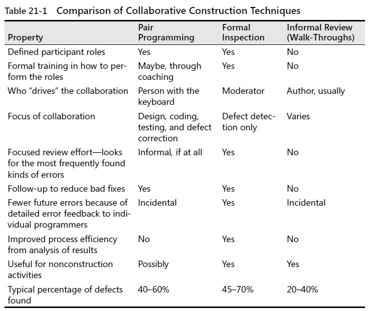

### 21.1 Overview of collaborative development practices
All collaborative construction techniques, despite their differences, are based on the
ideas that developers are blind to some of the trouble spots in their work, that other
people don’t have the same blind spots.Studies at the Software Engineering Institute have
found that developers insert an average of 1 to 3 defects per hour into their designs
and 5 to 8 defects per hour into code (Humphrey 1997), so attacking these blind
spots is a key to effective construction.

1. collaborative construction complements other quality-assurance Tech.
`KP:`Various studies have shown that in addition to being more effective at catching errors
than testing, collaborative practices find different kinds of errors than testing does

2. ... provides mentoring in corporate culture and programming expertise
`KP:`Reviews are an important mechanism for giving programmers feedback about their code. The code, the
standards, and the reasons for making the code meet the standards are good topics for review discussions

3. collective ownership applies to all forms of collaborative construction

4. collaboration applies as much before construction as after

### 21.2 Pair programming 
1. keys to success with pair programming - guidelines:
    + support pair programming with coding standards - two people MUST have same convention and focus on `essential` task at hand.
    + don't let pair programming turn into watching - the person without the keyboard is annalyzing the code, thinking ahead to what will be coded next, evaluating the design, and planning how to test the code.
    + don't force pair programming of the easy stuff
    + rotate pairs and work assignments regularly - changing pairs more often
    + encourage pair to match each other's pace - `match up is important`
    + make sure both partners can see the monitor
    + don't force people who don't like each other to pair
    + avoid pairing all newbies - at least one paired before
    + assign a team leader

2. benefits of pair programming
    + it holds up better under stress than solo development
    + it improves code quality
    + it shortens schedules
    + it produces all the other general benefits of collaborative construction

### 21.3 Formal inspections
* An inspection differs from a run-of-the-mill review:
    + checklists focus the reviewers' attention on areas that have been problems in the past
    + the inspection `focuses on` defect detection, not correction
    + reviewers prepare for the inspection meeting beforehand and arriv with a list of the problems they've discovered.
    + distinct roles are assigned to all participants
    + the moderator of the inspection  isn't the author of the work product under inspection
    + the moderator has received specific training in moderating inspections
    + the inspection meeting is held only if all participants have adequately prepared.
    + data is collected at each inspection and is fed into future inspections to improve them
    + general management doesn't attend the inspection unless you're inspecting a project plan

1. what results can you expect from inspections ?
    * is the technical work being done ?
    * is the technical work being done `well` ?

2. roles during an inspection - no fewer than three participants
    + Moderator - responsible for keeping the inspection moving at a rate that's fast enough to be productive but slow enough to find the most errors possible.
    + Author - the person who wrote the design or code plays a relatively minor role in the inspection, the design or code `MUST` be clear.
    + Reviewer - anyone who has a direct interest in the design or code but ho is not the author, the role is the `find defects`
    + Scribe - records errors that are detected and the assignments of action items during the inspection meeting
    + Management - need to know the inspection result rather than change the focus from technical to political

3. general procedure for an inspection
    1. planning - author gives the design or code to the moderator
    2. overview - the design or code should speak for itself
    3. preparation 
    4. inspecting meeting
    5. inspection report
    6. rework - assign defects to the author usually, for repair.
    7. Follow-up - moderator's responsibility
    8. Third-Hour meeting - dicuss solutios after offical inspection is over

    Fine-Tuning the inspection

4. egos in inspections - less criticism and respect author's ultimate right to decide how to resolve an error.

5. inspections and code complete

6. inspection summary
    * Inspection checklists encourage focused concentration. The inspection process is systematic
    because of its standard checklists and standard roles. It is also self-optimizing
    because it uses a formal feedback loop to improve the checklists and to monitor preparation
    and inspection rates. With this control over the process and continuing optimization,
    inspection quickly becomes a powerful technique almost no matter how it begins.

### 21.4 Other kinds of collaborative development practices

1. walk-throughs
    + `KP:`Inspections are more focused than walk-throughs and generally pay off better. Consequently,
    if you’re choosing a review standard for your organization, choose inspections
    first unless you have good reason not to.

2. code reading

3. dog-and-pony shows

