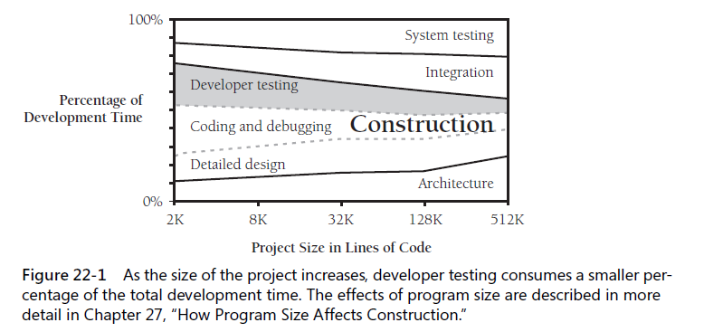

## Developer testing
1. `unit testing`
2. `component testing`
3. `integration testing`
4. `regression testing`
5. `system testing`

Here, testing for developer, mainly consists of 1~3, and sometimes 4 and 5.

### 22.1 Role of developer testing in SW quality
Testing is a hard activity for most developers to swallow for several reasons:
* testing's goal runs counter to the goals of other development activities.
* testing can never completely prove the absence of errors.
* testing by itself does not improve SW quality.
* testing requires you to assume that you'll find errors in your code.

Testing during construction

### 22.2 Recommended approach to developer testing
Systematic approach to developer:
* test for each relevant requirement to make sure that the requiremenets have been implemented.
* test for each relevant design concern to make sure that the design has been implemented
* use `basis testing` to add detailed test cases to those that test the requirements and the design.
* use a checklist of the kinds of errors you've made on the project to date or have made on previous projects

#### 1. Test first or test last ?

#### 2. Limitations of developer testing
* developer tests tend to be "clean tests" - code works rather than all the ways the code breaks
* developer testing tends to have an optimistic view of test coverage - believe 95% but actually 40%
* developer testing tends to skip more sophisticated kinds of test coverages

### 22.3 Bag of testing tricks
#### 1. incomplete testing
#### 2. structured basis testing
#### 3. data-flow testing 
- data in three states
    + defined
    + used
    + killed
- describe entering or exiting a routine - before or after the var is acted upon
    + entered
    + exited
- `combinations of date states` - all pairs 

#### 4. eauivalence partitioning

#### 5. error guessing
#### 6. boundary analysis
#### 7. class of `bad data`
+ too little data
+ too much data
+ the wrong kind of data
+ the wrong size of data
+ uninitialized data 
#### 8. class of `good data`
+ nominal cases - middle-of-the-road, expected values
+ minimum normal configuration
+ maximum normal configuration
+ compatibility with old data

#### 9. use test cases that make hand-checks convenient

### 22.4 Typical errors
#### 1. which classes contain the most errors ?
#### 2. errors by classification - suggestions:
* the scope of most errors is fairly limited
* many errors are outside the domain of construction
* most `construction errors` are the programmers' fault
* clerical errors (typos) are a surprisingly common source of problems
* misunderstanding the design is a recurring theme in studies of programmer errors
* most errors are easy to fix
* it's a good idea to measure your own organization's experiences with errors

#### 3. proportion of errors resulting from faulty construnction

#### 4. how many errors should you expect to find ?

#### 5. errors in testing itself - several things to reduce num of errors:
* check your work
* plan test cases as you develop your software
* keep your test cases
* plug unit tests into a test framework

### 22.5 Test-support tools
#### 1. building scaffolding to test individual classes
#### 2. diff tools
#### 3. test-data geneators
#### 4. coverage monitors - keeps track of the code that's exercised and the code isn't
#### 5. data recorder/logging
#### 6. symbolic debuggers
#### 7. system perturbers - capabilities
* memory filling
* memory shaking
* selective memory failing
* memory-access checking
#### 8. error databases
* a database of errors that have been reported
### 22.6 Improving your testing
1. planning to test
2. retesting(regression testing)
3. automated testing

### 22.7 Keeping test records
Measure the project so that you can tell for sure whether changes improve or degrade it, below are a few kinds of data you can collect:
* administrative description of the defect - like JIRA
* full description of the problem
* steps to take to repeat the problem
* related defects
* severity of the problem - fatal, bothersome, or cosmetic
* origin of the defect: requirements, design, coding, or testing
* subclassification of a coding defect
* classes and routines changed by the fix
* number of lines of code affected by the defect
* hours to find the defect
* hours to fix the defect

Personal test records - useful

---
checklist

