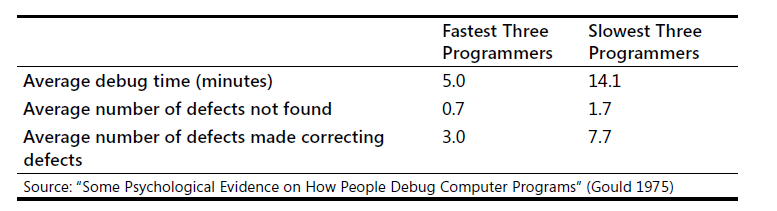
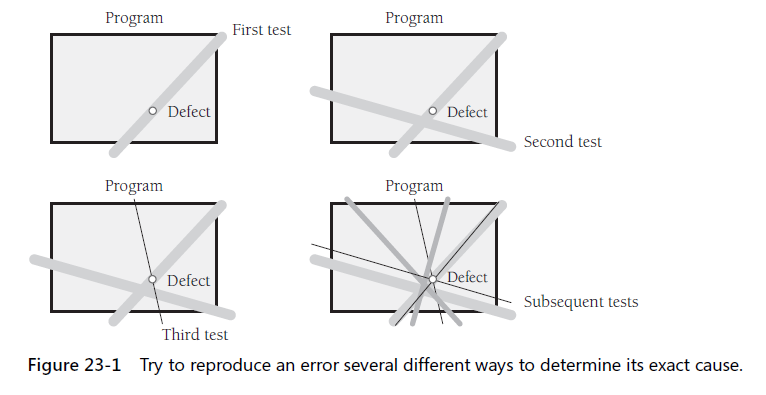

Debugging is the process of identifying the root cause of an error and correcting it.

### 23.1 Overview of debugging issues

#### 1. role of debugging in software quality
* it's a way to diagnose defects
#### 2. variations in debugging performance

#### 3. defects as opportunities - you can:
* learn about the program you're working on
* .. the kinds of mistakes you make
* .. the quality of your code from the point of view of somehone who has to read it
* .. how you solve problems
* .. how you fix defects

#### 4. an ineffective approach
The devil's guide to debugging - common approaches:
* find the defect by guessing
* don't waste time trying to understand the problem - find is enough
* fix the error with the most obvious fix

Debugging by superstition
* `KP:`Even if an error at first appears not to be your fault, it’s strongly in your interest to
assume that it is

### 23.2 Find a defect

#### The scientific method of debugging
1. stabilize the error
2. locate the source of the error
    * a. gather the data that produces the defect
    * b. analyze the data that has been gathered, and form a hypothesis about the defect
    * c. determine how to prove or disprove the hypothesis, either by testing the program or by examining the code
    * d. prove or disprove the hypothesis by using the prodedure identified in 2.c
3. fix the defect
4. test the fix
5. look for similar errors

#### Tips for find defects
* use all the data available to make your hypothesis 
* refine the test cases that produce the error
* exercise the code in your unit test suite
* use available tools
* reproduce the error several different ways
    
* generate more data to generate more hypothesis
* use the results of negative tests
* brainstorm for possible hypotheses
* keep a notepad by your desk, and make a list of things to try
* narrow the suspicious region of the code
* be suspicious of classes and routines that have had defects before
* check code that's changed recently
* expand the suspicious region of the code
* integrate incrementally
* check for common defects
* talk to someone else about the problem
* take a break from the problem

Brute-Force Debugging

#### Syntax errors
* Don't trust line numbers in compiler message
* Don't trust compiler messages
* don't trust compiler's second message
* divide and conquer
* find misplaced comments and quotation marks

### 23.3 Fixing a defect

### 23.4 Psychological considerations in debugging

### 23.5 Debugging tools - obvious and not-so-obvious

