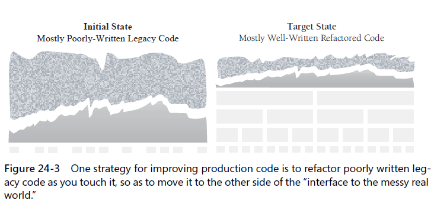

### 24.1 Kinds of SW evolution
`KP:` the key distinction between kinds of SW evolution is whether the program's quality improves or degrades under modification; a second distinction is the one between changes made during construction and those made during maintenance.

#### Philosophy of SW Evolution
`The cardinal rule of SE is that the evolution should improve the internal quality of the program`

### 24.2 Introduction to refactoring 
Decomposing a program `into its consituent parts` as much as possible

#### Reasons to refactor
* code is duplicated - *copy and past is a design error*
* a routine is too long
* a loop is too long or too deeply nested
* a class has poor cohesion
* a class interface does not provide a consistent level of abstraction
* a parameter list has too many parameters
* changes within a class tend to be compartmentalized
* changes require parallel modifications to multiple classes
* inheritance hierarchies have to be modified in parallel
* *case* statements have to be modified in parallel
* related data items that are used together are not organized into classes
* a routine uses more features of another class than of its own class
* a primitive data type is overloaded
* a class doesn't do very much - assign to all other classes and eliminate the class
* a chain of routines passes tramp data
* a middleman object isn't doing anything
* one class is overly intimate with another
* a routine has a poor name
* data members are public
* a subclass uses only a small percentage of its parents' routines
* comments are used to explain difficult code - `Don't Doc bad code - rewrite it`
* global var are used
* A routine uses setup code before a routine call or takedown code after a routine call
* a program contains code that seems like it might be needed someday

#### Reasons not to refactor

### 24.3 Specific refactorings

#### Data-level refactoring
* replace a magic number with a named constant
* rename a var with a clearer or more informative name
* move an expression inline
* replace an expression with a routine
* introduce an intermediate var
* convert a multiuse var to multiple single-use vars
* use a local var for local purpose rather than a parameter
* convert a data primitive to a class
* convert a set of type codes to a class or qn enumeration
* convert a set of type codes to a class with subclasses
* change an array to an object
* encapsulate a collection
* replace a traditional record with a data class

#### Statement-level ...
* decompose a boolean expression
* move a complex boolean expression into a well-named boolean function
* consolidate fragments that are duplicated within different parts of a conditional
* use break or return instead of a loop control var
* return as soon as you know the answer instead of assigning a return value within nested *if-then-else* statements
* replace conditionals(especially repeated case statements) with polymorphism
* creating and use *null* objects instead of testing for null values

#### Routine-level ...
* extract a routine/extract method - remove inline code from one routine, and turn it into its own routine
* move a routine's code inline
* convert a long routine to a class
* substitute a simple algorithm for a complex algorithm
* add a parameter
* remove a parameter
* separate query operations from modification operation
* combine similar routines by parameterizing them
* separate routines whose behavior depends on parameters passed in
* pass a whole object rather than specific fields
* pass specific fields rather than a whole object
* encapsulate downcasting

#### Class implementation ...
* change value objects to reference objects - only one master copy exists (value objects)
* change reference objects to value objects
* replace virtual routines with data initialization
* change member routine or data placement
* extract specialized code into a subclass
* combine similar code into a superclass

#### Class interface ...
* move a routine to another class 
* convert one class to two
* eliminate a class
* hide a delegate - class A -> B -> C
* remove a middleman
* replace inheritance with delegation
* replace delegation with inheritance
* introduce a foreign routine
* introduce an extension class
* encapsulate an exposed member var
* remove set() routines for fields that cannot be changed
* hide routines that are not intended to be used outside the class
* encapsulate unused routines
* collapse a superclass and subclass if their implementations are very similar

#### System-level ...
* create a definitive reference source for data you can't control
* change unidirectional class association to bidirectional class association
* change bidirectional class association to unidirectional class association
* provide a factory method rather than a simple constructor
* replace error codes with exceptions or vice versa

### 24.4 Refactoring safely

Guidelines:
* save the code your start with
* keep refactoring small
* do refactoring one at a time
* make a list of steps you intend to take
* make a parking lot
* make frequent checkpoints
* use your compiler warnings
* retest
* add test cases
* review the changes
* adjust your approach depending on the risk level of the refactoring

#### Bad time to ...
* don't use refactoring as a cover for code and fix
* avoid refactoring instead of rewriting

### 24.5 Refactoring strategies

Guidelines:
* refactor when you add a routine
* .. when you add a class
* .. when you fix a defect
* target error-prone modules
* target high-complexity modules
* in a maintenance environment, improve the parts you touch
* define an interface between clean code and ugly code, and then move code across the interface
