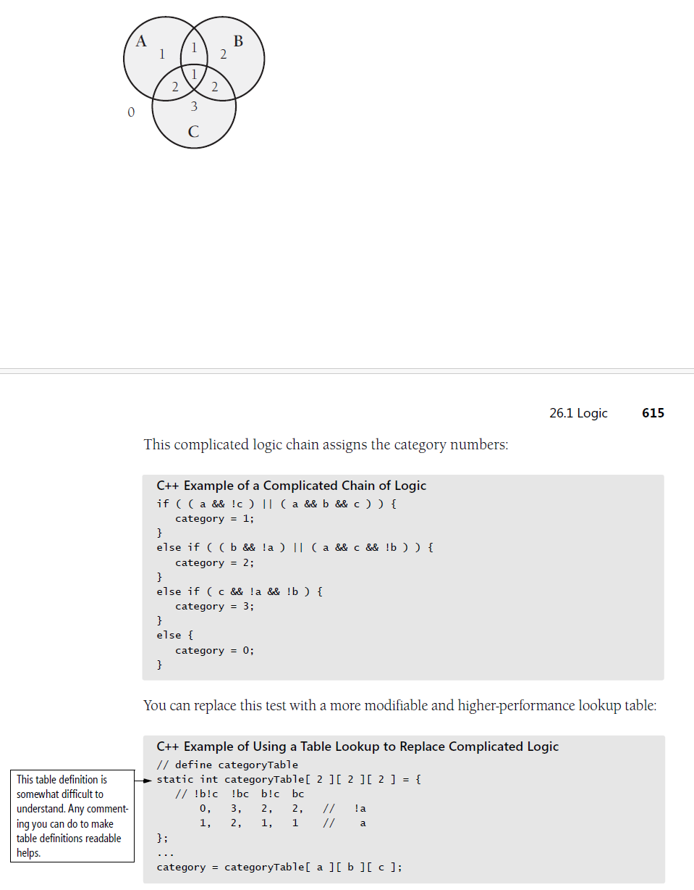
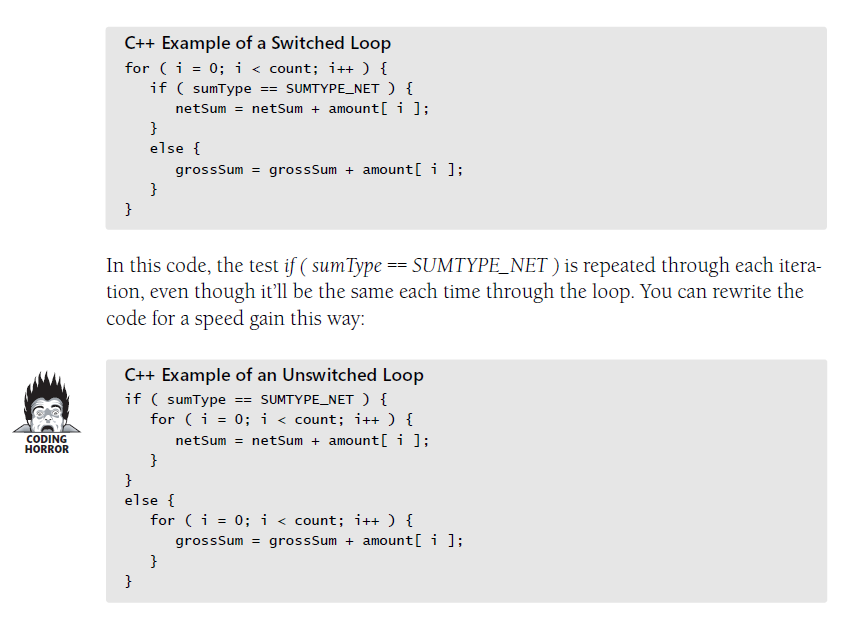
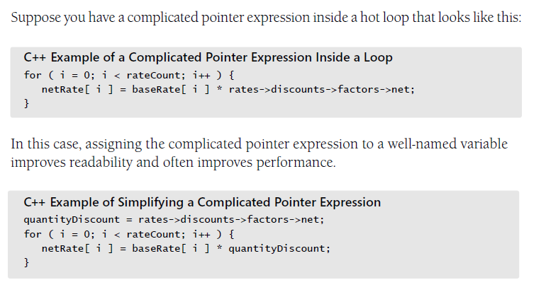
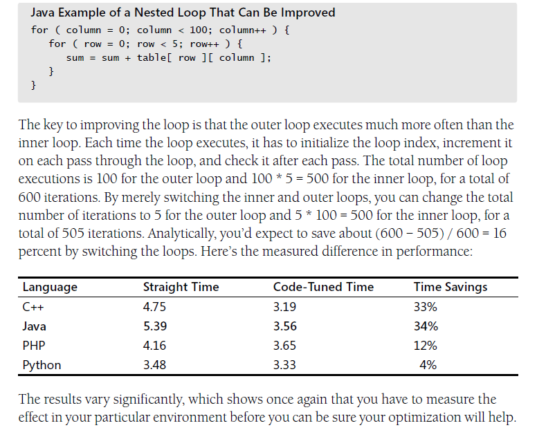

This chapter `focuses on` improving speed and includes a few tips for making code smaller. `anti-refactorings` which far frome `improving the internal structure`

### 26.1 Logic

#### Stop testing when you know the answer
```
if S1 and S2 then ...
```
#### Order tests by frequency
* arrange tests so that the one that's `fastest and most likely to be true` is performed first.
* compiler generates different code for *case* and *if-then-else* statements, which in turn effect the performance

#### Compare performance of similar logic structures
* there is simply no reliable substitute for *measuring* results

#### Substitute table lookups for complicated expressions


#### Use lazy evaluation
* If a program uses lazy evaluation, it avoids doing any work until the work is needed. Lazy evaluation is similar to just-in-time strategies that do the work closest to when it’s needed.

### 26.2 Loops - make the loop itself faster (find hot spots)

#### Unswitching 

* this example - the effect of any specific code tunning is not predicatable

#### Jamming
* Jamming is the result of combining two loops that operate on the same set of elements.

#### Unrolling 
* the goal of loop unrolling is to reduce the amount of loop housekeeping.
* although completely unrolling a loop is a fast solution and works well when you're `dealing with a small number of elements`, it's not practical when you have large number of elements or when you don't know in advance how many elements you'll have.

#### Minimizing the work inside the loop
* one key to writing effective loops is to minimize the work done inside a loop.
* if you can evaluate a statement or part of a statement outside a loop so that the result is used inside the loop, do so. it's `good programming practice, and in some cases it improves readability`


#### Sentinel values
* the sentinel technique can be applied to virtually any situation in which you use a linear search-to linked lists as well as arrays.
* careful about how you choose and put the sentinel value

#### Putting the busiest loop inside


#### Strength reduction
* means replacing an expensive operation such as multiplication with a cheaper operation such as addition

### 26.3 Data transformations

#### Use integers rather than floating-point numbers
#### Use the fewest array dimensions possible
#### Minimize array references
#### Use supplementary indexes
* means adding related data that makes accessing a data type more efficient. you can add it to the main data type, or you can store it in a parallel structure.
    + string-length index
    + independent, parallel index structure - <key, value> pairs 
#### Using caching
* means saving a few values in such a way that you can retrieve the most commonly used values more easily than the less commonly used values. - like `dynamic programming` which cache lots of intermediate result for look up.
* Generally, `the more it costs to generate a new element` and `the more times the same information` is requested, the more valuable a cache is.

### 26.4 Expressions
* complicated expressions tend to be expensive, so this section looks at ways to make them cheaper

#### Exploit algebraic identities
```
not a and not b
not (a or b) - save a not
```
#### Use strength reduction
* replace multiplication with addition
* replace exponentiation with multiplication
* replace trigonometric routines with their trigonometric identities
* ...

#### Initialize at compile time
* named constant or magic number in a routine

#### Be wary of system routines
* system routines are expensive and provide accuracy that's often wasted.
* take advantage of the fact that a right-shift operation is the same as dividing by two

#### Use the correct type of constants

#### Precompute results
* a common low-level design decision is the choice of whether to compute results on the fly or compute them once, save them and look them up as needed.
* if result are used many times, it's often cheaper
* optimizing a program by precomputation can take several forms:
    + computing results before the program executes, and wiring them into constants that are assigned at compile time
    + ..., and hard-coding them into vars used at run time
    + ..., and putting them into a file that's loaded at run time
    + computing results once, at program startup, and then referencing them each time they're needed
    + computing as much as possible before a loop begins, minimizing the work done inside the loop
    + computing results the first time they're needed, and storing them so that you can retrieve them when they're needed again.

#### Eliminate common subexpressions
* if you find an expression that's repeated several times, assign it to a var and refer to that var rather than recomputing the expression in several places.

### 26.5 Routines
one of the most powerful tools in code tuning is a good routine decomposition.

#### Rewrite routines inline

### 26.6 Recording in a low-level language
Typical approach to optimizing with a low-level language:
1. write 100 percent in high-level 
2. fully test, and it's correct
3. if performance improvements are needed after that, profile the application to identify `hot spots`. 
4. recode a few small pieces in a low-level language to improve overall performance.

### 26.7 The more things change, the more they stay the same
* In other ways, performance issues have hardly changed at all. People writing desktop
applications may not need this information, but people writing software for embedded
systems, real-time systems, and other systems with strict speed or space restrictions
can still benefit from it.
---
checklist