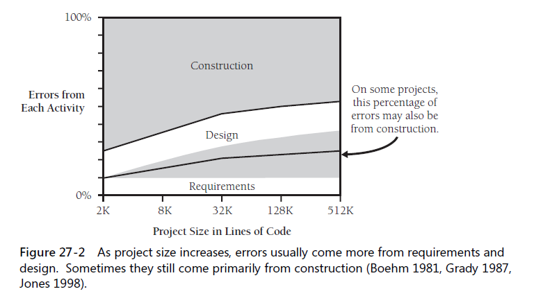
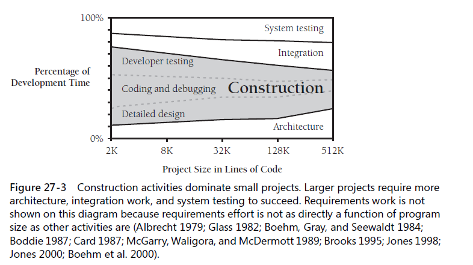

If you’ve been accustomed to working on small projects, your first medium-to-large
project can rage riotously out of control, becoming an uncontrollable beast instead of
the pleasant success you had envisioned.
* what kind of beast to expect ?
* where to find the whip and chair to tame it ?

### 27.1 Communication and size
* `KP:` Larger-size projects demand organizational techniques that streamline communication or limit it in a sensible way.
* the typical approach taken to streamlining communication is to `formalize` it in documents.

### 27.2 Range of project sizes

### 27.3 Effect of project size on errors
* both quantity and type of errors are affected by project size

* `KP:` as the kinds of defects change with size, so do the numbers of defects; the product that's twice as large is likely to have more than twice as many errors

### 27.4 Effect of project size on productivity

* Productivity on small projects can be 2–3 times as high as productivity on large projects, and productivity can vary by a factor of 5–10 from the smallest projects to the largest

### 27.5 Effect of project size on development activities

#### Activity proportions and size
* small project, 65% in construction
* medium-size, 50% ...
* on very large projects, arch, integration, and system testing take up more time and construction becomes less dominant.

#### Programs, products, systems, and system products

#### Methodology and size