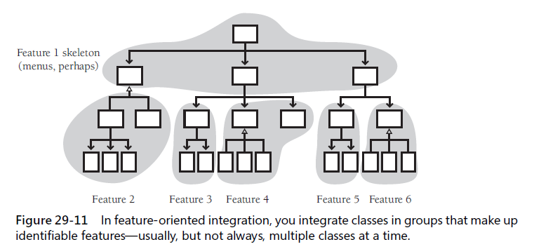
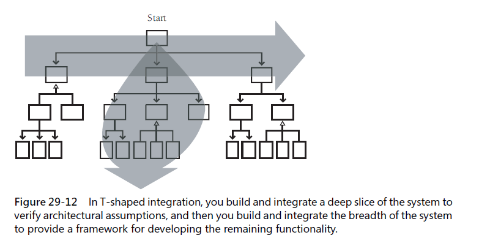

### 29.1 Importance of the integration approach
Benefits from careful integration:
+ easier defect diagnosis
+ fewer defects
+ less scaffolding
+ ...

### 29.2 Integration frequency - phased or incremental?

#### Phased integration - "bid bang integration"
* problem - the causes could be anywhere since you have a large number of classes that have never worked together before.
* might be the best approach for small programs

#### Incremental integration - `one-piece-at-a-time`

#### Benefits of incremental integration
* errors are easy to locate
* the system succeeds early in the project
* you get improved progress monitoring
* you'll improve customer relations
* the units of the system are tested more fully
* you can build the system with a shorter development schedule

### 29.3 Incremental integration strategies

#### Top-down integration 
* An important aspect of top-down integration is that the interfaces between classes must be carefully specified.
* an advantage of top-down integration is that the control logic of the system is tested relatively early

#### Bottom-up integration

#### Sandwich integration
* leave the middle-level classes until later

#### Risk-oriented integration - `hard part first integration`
* identify the level of risk associated with each class

#### Feature-oriented integration
* integrate one feature at a time

#### T-shaped integration
* In this approach, one specific vertical slice is selected for early development and integration

#### Summary of integration approaches
* Like software-design approaches, they are heuristics more than algorithms, and rather than following any procedure dogmatically, you come out ahead by making up a unique strategy tailored to your specific project.

### 29.4 Daily build and smoke test

#### What kinds of projects can use the daily build process ?

#### Continuous integration

