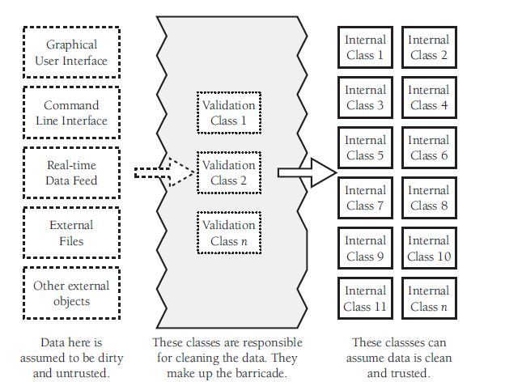
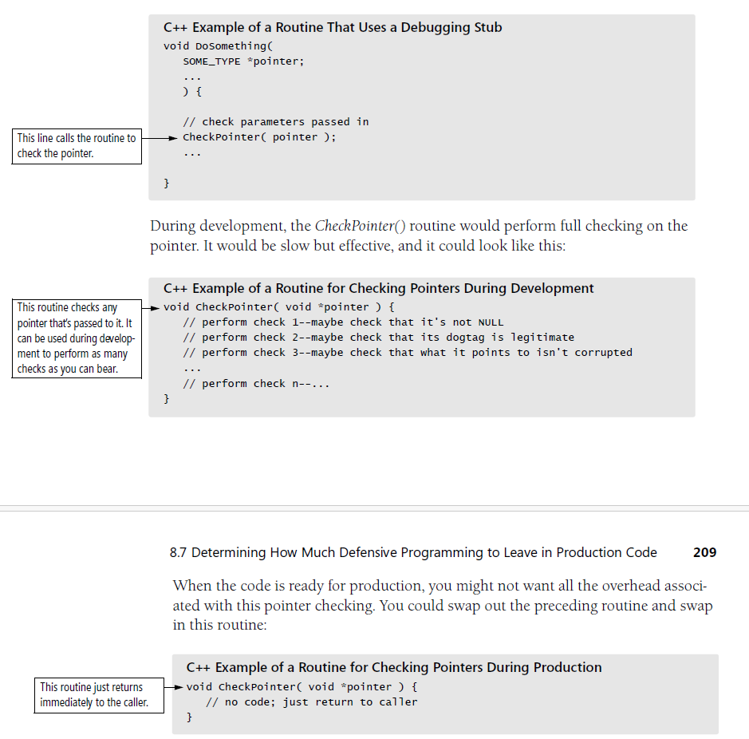

## Key point

1. In defensive programming, the main idea is that if a routine is **passed bad data**, it won't be hurt, even if the bad data is another routine's fault.

### 8.1 Protecting your program from invalid inputs


### 8.2 Assertions

1. Assertion are especially useful in **large, complicated programs and in high-reliability** programs.
2. During **development**, assertions flush out contradictory assumptions, unexpected conditions, etc., during **production**, they can be compiled out of the code so that the assertions don't degrade system performance.

#### Build your own assertion mechanism

#### Guidelines for using assertions

1. Use error-handling code for conditions you **expect to occur**; use assertions for conditions that should **never occur**.
2. Avoid putting executable code into assertions.
3. Use assertions to **document and verify** preconditions and postconditions. - {p}S{q} where p is precondition and q is postcondition [correctness-tripple].
4. For highly robust code, assert and then handle the error anyway.

### 8.3 Error-handling Tech.

1. return a neutrual value
2. substitute the next piece of valid data
3. return the same answer as the previous time
4. substitute the closest legal value
5. log a warning message to a file
6. return an error code

`specific mechanism for notifying the rest of the system that an error has occurred:`

+ set the value of a status var
+ return status as the function's return value
+ throw an exception by using the language's built-in exception mechanism

7. call an error-processing routine/object
8. display an error message whenever the error is encountered.
9. handle the error in whatever way works best locally.
10. shut down

`robustness vs. correctness`

+ ***correctness*** means never returning an inaccurate result, returning no result than returning inaccurate result.
+ ***robustness*** means always trying to do something that will allow the software to keep operating. 

`High-Level design implications of error processing`
1. Deciding on a general approach to bad parameters is an architectural or high-level design decision and should be addressed at one of those levels.
2. Once you decide on the approach, make sure you follow it consistently.
3. the **whole point** of defensive prog is guarding against errors you don't expect.

### 8.4 Exceptions

Exceptions have an attribute in common with inheritance:
1. used judiciously, they can reduce complexity.
1. used imprudently, they can make code almost impossible to follow.

Suggestions for realizing the benefits of exceptions and avoiding the difficulties often associated with them:
1. Use exceptions to **notify other parts** of the program about errors that should not be ignored.
2. Throw an exception only for conditions that are truly exceptional.
3. Don't use an exception to pass the buck - handle it **locally** when possible.
4. Avoid throwing exceptions in constructors and destructors unless you catch them in the same place.
5. Throw exception at the right level of abstraction.
6. Include in the exception message all info that led to the exception.
7. Avoid empty catch blocks.
    ```
    try {
        ...
    } catch {
        
    }
    ```

8. Know the exceptions your lib code throws.
9. Consider building a centralized exception reporter.
   `the centralized reporter provides a central repository for knowledge about what kinds of exceptions there are, how each exception should be handled. formatting of exception message, etc.`
10. Standarlize your project's use of exceptions.

**Somethimes the best response to a serious run-time error is to release all acquired resoures and abort**

### 8.5 Barricade your program to contain the damage caused by errors

Barricades are a damage-containment strategy.



Convert input data to the proper type at input time - ASAP after input

### 8.6 Debugging aids

1. Don't auto apply production constraints to the development version

`KP`: Be willing to trade speed and resource usage during development in exchange for built-in tools that can make dev go more smoothly.

2. Introduce debugging aids early

3. Use offensive programming
    + Make sure ***asserts*** abort the program. (make the problem painful enough that it will be fixed)
    + Completely fill any memory allocated so that you can detect memory allocation errors.
    + Completely fill any files or streams allocated to flush out any file-format errors.
    + Be sure the code in each ***case*** statement's default or else clause fails hard.
    + Fill an obj with junk data just before it's deleted.
    + Set up the program to e-mail  error log files to yourself so that you can see the kinds of errors.

4. Plan to remove debugging aids
    + Use version-control tools and build tools like ant and make
    + Use a built-in preprocessor
    + Write your own preprocessor
    + Use debugging stubs
    

### 8.7 Determining how much defensive programming to leave in production code

1. Leave in code that checks for important errors
2. Remove code that checks for trivial errors
3. Remove code that results in hard crashes - if your program contains debugging code that could cause a loss of data, take it out of the production version.
4. Leave in code that helps the program crash gracefully.
5. Log errors for your technical support personnel.
6. Make sure that the error msg you leave in are friendly.

### 8.8 Being defensive about defensive programming
