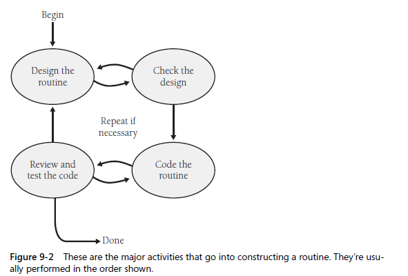
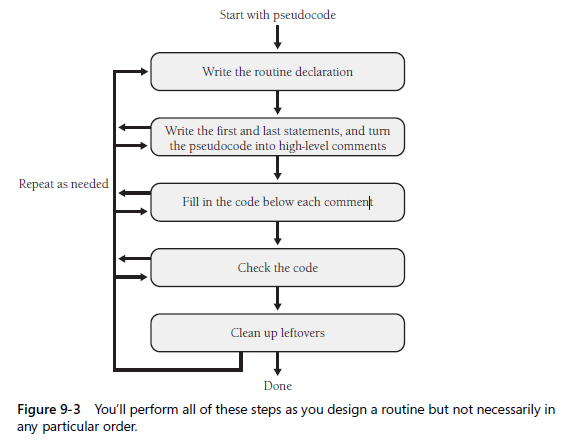

## Focus on specific steps for building an individual class and its routines.

### 9.1 Summary of steps in building classes and routines

`steps in creating a class`
1. creating a general design for the class
2. construnct each routine within the class
3. review and test the class as a whole

`steps in building a routine`

### 9.2 Pseudocode for pros

`KP:` Programmers prefer pseudocode for the way it eases construction in a programming language, for its ability to help them detect insufficiently detailed designs, and for the ease of Docs and ease of modification it provides.

### 9.3 Constructing routines by using PPP

1. Design the routine
    + check the prerequisites
    + define the problem the routine will solve
    + name the routine
    + decide how to test the routine
    + research functionality available in the standard libs - **reuse good code, do not reinvent wheels**
    + think about error handling - anything could possibly go wrong
    + think about efficiency
    + research the algorithms and data types
    + write the pseudocode - Def. of key data types are useful to have when you design the logic of a routine.
    + check the pseudocode - invite someone to explain and discuss
    + try a few ideas in pseudocode, and keep the best

2. Code the routine

    

3. Check the code
    + mentally check the routine for errors - `KP:` A working routine isn't enough. If you don't know why it works, study it, discuss it, and experiment with alternative designs until you do.
    + compile the routine
    + step through the code in the debugger
    + test the code
    + remove errors from the routine

4. clean up leftovers
    + check the routine's interface
    + check for general design quality - `do one thing and does it well, and loosely coupled to other routines, and designed defensively`
    + check the routine's vars
    + check the routine's statements and logic
    + check the routine's layout
    + check the routine's Docs
    + remove redundant comments

5. repeat steps as needed 

### 9.4 Alternatives to the PPP

Recommended by other experts:
+ test-first development - test cases in advance
+ refactoring - REF C-24
+ design by contract - in which each routines is considered to have preconditions and postconditions
+ hacking

